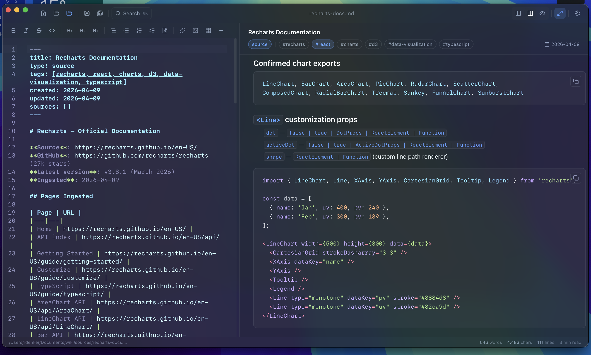

# NoteBuddy

Fast, local-first markdown editor. Built with Tauri v2, React 19, and Rust. Notes live on your machine — no cloud, no accounts.



---

## Who is this for?

NoteBuddy is built for people who want a **fast, keyboard-driven writing environment** that stays out of the way — and keeps their data.

**Writers & journalers** who want plain-text notes with beautiful rendering, not a subscription SaaS with a proprietary format.

**Developers** who write docs, READMEs, and ADRs alongside their code — and want Mermaid diagrams, KaTeX math, and code blocks that actually look good.

**Researchers & students** building a personal knowledge base with wikilinks, frontmatter tags, and cross-referenced notes.

**Power users** who need command-palette speed, regex search, templates, and full theme control without touching a config file.

NoteBuddy is **not** a team collaboration tool, a database-backed notes app, or a replacement for Notion/Obsidian Publish. It's a local editor, nothing more.

---

## Features

- **Live split preview** — editor + rendered markdown side by side, draggable divider
- **Tabs** — multiple open files, middle-click to close, unsaved indicator
- **Smart autocomplete** — markdown snippets, language keywords, symbols, emoji (`:smile:`)
- **Syntax highlighting** — 20+ languages via highlight.js
- **Mermaid diagrams** — rendered live in preview
- **KaTeX math** — inline `$` and display `$$`
- **Wikilinks** — `[[Note Name]]` opens linked notes
- **Frontmatter** — YAML metadata bar with clickable tag chips
- **Tag + date filtering** — filter file tree by frontmatter tags or `created` date
- **Bookmarks** — pin files to top of sidebar
- **Templates** — `_templates/` folder with `{{date}}` substitution
- **Command palette** (`⌘K`) — full-text search + command launcher
- **Find & replace** (`⌘F`) — regex, case, whole-word, replace all
- **Export** — PDF (`⌘P`) or standalone HTML
- **Zen mode** (`⌘⇧Z`) — distraction-free writing
- **Themes** — 7 app themes, 13 editor themes, 5 code block themes, all fully customizable
- **Window vibrancy** — macOS native blur/transparency

---

---

## Roadmap

Planned or actively considered. Not commitments, not a timeline.

### Near-term

- [ ] **Vim keybindings** — modal editing (normal/insert/visual) via CodeMirror's vim extension, toggleable in settings
- [ ] **Windows & Linux support** — Tauri builds for non-macOS targets, vibrancy fallbacks
- [ ] **Image paste previews** — show pasted images inline in the editor (currently preview-only)
- [ ] **Folder-level sort & group** — sort by name, date, type; group by frontmatter field
- [ ] **Drag-and-drop file reordering** — reorder sidebar items and tabs by dragging
- [ ] **Word count goals** — set a daily/per-note target, progress shown in status bar

### Medium-term

- [ ] **Graph view** — visualize wikilink connections as an interactive node graph
- [ ] **Backlinks panel** — see all notes that link to the currently open note
- [ ] **Quick capture** — global hotkey to create a new note from anywhere on the system
- [ ] **Spellcheck** — native OS spellcheck integration in the editor
- [ ] **Note history** — local version history per file, diff view, one-click restore
- [ ] **Custom sidebar panels** — pin a tag filter, a template list, or backlinks as a persistent side panel
- [ ] **Slash commands** — type `/` in editor to insert blocks (table, code fence, callout, frontmatter) via inline menu

### Longer-term / exploratory

- [ ] **Plugin API** — extend autocomplete sources, add custom preview renderers, hook into file events
- [ ] **Optional sync** — encrypted, user-controlled sync (no proprietary cloud — bring your own S3/iCloud/git)
- [ ] **Mobile companion** — read-only iOS app that opens the same folder via Files app
- [ ] **AI writing assistant** — local model integration (Ollama) for inline suggestions, summarization, tag generation — opt-in, fully offline
- [ ] **AI API integration** — bring your own API key (OpenAI, Anthropic, etc.) for cloud model access; keys stored locally, never leaves your machine, fully opt-in

### Won't do

- Cloud storage with NoteBuddy accounts
- Real-time multiplayer / commenting
- A web app version

---

## Getting started

### Prerequisites

| Tool | Version |
|---|---|
| Rust + Cargo | ≥ 1.77 |
| Bun | ≥ 1.0 |
| Xcode (macOS) | latest |

```bash
# Install Rust
curl --proto '=https' --tlsv1.2 -sSf https://sh.rustup.rs | sh

# Install Bun
curl -fsSL https://bun.sh/install | bash
```

### Run in development

```bash
git clone https://github.com/yourname/notebuddy
cd notebuddy
bun install
bun run tauri dev
```

### Build for production

```bash
bun run tauri build
# Output: src-tauri/target/release/bundle/
```

---

## Keyboard shortcuts

| Shortcut | Action |
|---|---|
| `⌘S` | Save |
| `⌘K` | Command palette |
| `⌘F` | Find & replace |
| `⌘P` | Print / Export PDF |
| `⌘⇧Z` | Toggle zen mode |
| `Ctrl+Space` | Trigger autocomplete |
| `Tab` | Accept suggestion |
| `Esc` | Dismiss / exit zen mode |

---

## Tech stack

| Layer | Technology |
|---|---|
| Desktop runtime | Tauri v2 |
| Frontend | React 19 + TypeScript + Vite |
| Styling | Tailwind CSS v4 + shadcn/ui (Radix) |
| Editor | CodeMirror 6 |
| Markdown parsing | pulldown-cmark (Rust) |
| State | Zustand (persisted) |
| Animations | Framer Motion |
| Diagrams | Mermaid.js |
| Math | KaTeX |

---

## Documentation

| Guide | Description |
|---|---|
| [User Guide](docs/USER_GUIDE.md) | Features, workflows, keyboard shortcuts |
| [Developer Guide](docs/DEVELOPER.md) | Architecture, state, adding features |
| [Theming Guide](docs/THEMING.md) | Custom app, editor, and code block themes |

---

## License

MIT
