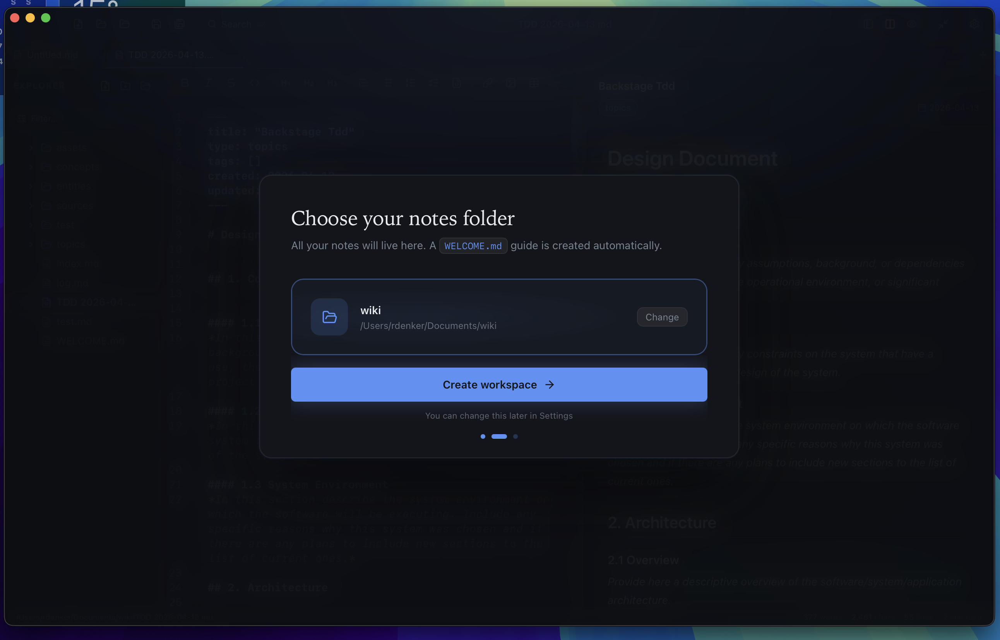
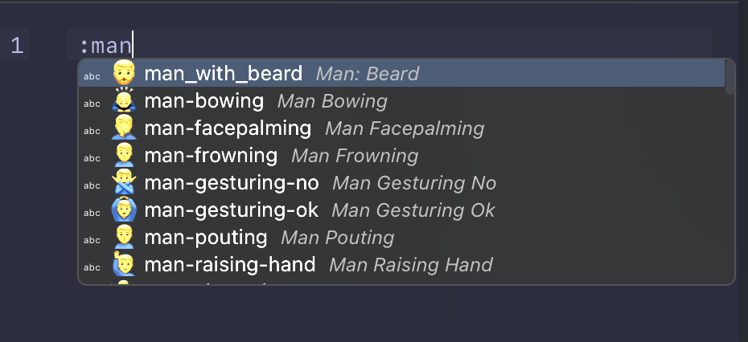
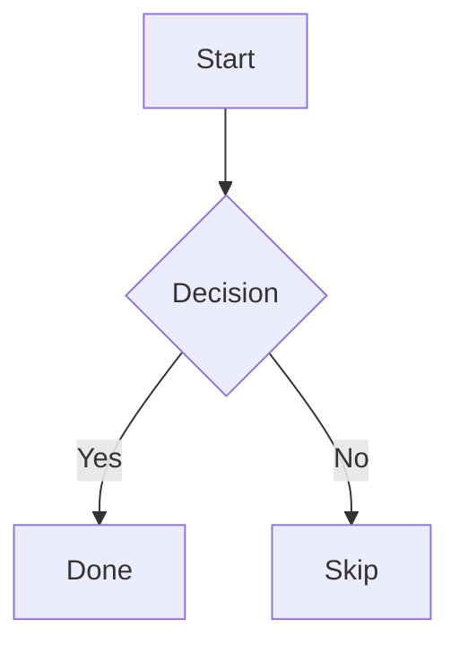
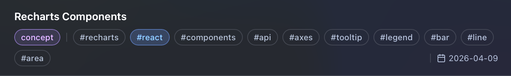
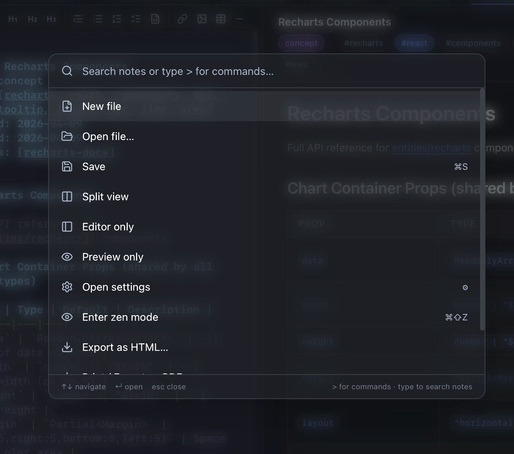
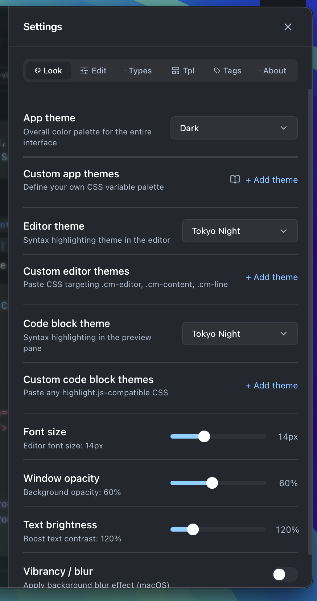

# User Guide

> New here? See the [README](../README.md) for setup. Developers see the [Developer Guide](DEVELOPER.md). For custom themes see the [Theming Guide](THEMING.md).

---

## Contents

1. [First launch](#1-first-launch)
2. [Interface overview](#2-interface-overview)
3. [Files & tabs](#3-files--tabs)
4. [Writing markdown](#4-writing-markdown)
5. [Wikilinks](#5-wikilinks)
6. [Code blocks](#6-code-blocks)
7. [Mermaid diagrams](#7-mermaid-diagrams)
8. [Math (KaTeX)](#8-math-katex)
9. [Frontmatter](#9-frontmatter)
10. [Emoji autocomplete](#10-emoji-autocomplete)
11. [Filtering notes](#11-filtering-notes)
12. [Bookmarks](#12-bookmarks)
13. [Templates](#13-templates)
14. [Command palette](#14-command-palette-k)
15. [Find & replace](#15-find--replace-f)
16. [Zen mode](#16-zen-mode-z)
17. [Export](#17-export)
18. [Settings](#18-settings)
19. [Keyboard shortcuts](#19-keyboard-shortcuts)

---

## 1. First launch

On first launch the **onboarding wizard** runs:

1. **Welcome** — feature overview
2. **Choose folder** — pick where notes live. `WELCOME.md` is created automatically.
3. **Tour** — interactive walkthrough of every UI section

Folder is remembered and reopened on every launch.

To restart onboarding at any time: **Settings → About → Reset onboarding**.



---

## 2. Interface overview

```
┌────────────────────────────────────────────────────────┐
│  Toolbar  (traffic lights · actions · ⌘K · panels · ⚙) │
├────────────────────────────────────────────────────────┤
│  Tab bar  (open files · + new tab)                      │
├──────────┬─────────────────────────┬───────────────────┤
│          │       Editor            │     Preview       │
│ Sidebar  │  CodeMirror 6           │  Rendered HTML    │
│          │  syntax highlighting    │  + diagrams       │
│ Bookmarks│  autocomplete           │  + math           │
│ Files    │  find & replace         │  + wikilinks      │
│ Filter   │                         │                   │
├──────────┴─────────────────────────┴───────────────────┤
│  Status bar  (path · words · chars · reading time)      │
└────────────────────────────────────────────────────────┘
```


- **Sidebar** — file tree, bookmarks, tag/date filter. Drag the right edge to resize.
- **Editor** — CodeMirror 6. Full markdown syntax highlighting + autocomplete.
- **Preview** — live-rendered HTML. Draggable divider between editor and preview.
- **Toolbar** — new file, open folder, command palette, panel toggles, settings.
- **Status bar** — current path, word/char count, estimated reading time.

---

## 3. Files & tabs

### Opening files

- Click any `.md` file in the sidebar
- `⌘K` → type filename to search and open
- Toolbar folder icon → open file directly

### Tabs

- Each file opens in its own tab
- **+** button or New File creates a blank tab
- **Middle-click** a tab to close it
- Blue dot = unsaved changes; closing prompts for confirmation


### File management

- **Hover** file/folder → reveals rename (✎) and delete (🗑) icons
- **Right-click** → context menu with rename, delete, new file, from template
- **+ button** on sidebar header creates file in root folder
- **Folder icon** in toolbar opens a different root folder

---

## 4. Writing markdown

Full GitHub Flavoured Markdown supported:

```markdown
# Heading 1
## Heading 2
### Heading 3

**bold**  *italic*  ~~strikethrough~~

- Bullet list
1. Numbered list
- [ ] Task checkbox

> Blockquote

[Link](https://example.com)


| Column 1 | Column 2 |
| --- | --- |
| Cell | Cell |
```

### Autocomplete

`Ctrl+Space` triggers suggestions. Autocomplete sources:

| Source | Examples |
|---|---|
| Markdown snippets | `\`\`\``, `---`, frontmatter block |
| Language keywords | `function`, `async`, `const` (inside code fences) |
| Local symbols | Headings + filenames from your folder |
| Emoji shortcodes | `:smile:`, `:rocket:` |

`Tab` accepts. `Esc` dismisses.



---

## 5. Wikilinks

Link notes with double brackets:

```markdown
See also [[My Other Note]] for more context.
```

Clicking the link in preview opens `My Other Note.md` from your folder. If the file doesn't exist, the link is styled differently.

---

## 6. Code blocks

Fenced blocks are syntax-highlighted in preview and get language-aware autocomplete in editor:

````markdown
```typescript
function greet(name: string) {
  return `Hello, ${name}!`;
}
```
````

Supported: TypeScript, JavaScript, Python, Rust, Go, Java, C++, SQL, Bash, CSS, HTML, YAML, and more.

Each preview code block has a **copy button** (top-right corner).

Theme is controlled by the code block theme setting — see [Theming Guide → Code block themes](THEMING.md#3-code-block-themes).

---

## 7. Mermaid diagrams

````markdown

````


Full Mermaid syntax supported: flowcharts, sequence diagrams, Gantt charts, pie charts, ER diagrams.

---

## 8. Math (KaTeX)

Inline: wrap in `$...$`

```markdown
The formula is $E = mc^2$.
```

Display block: wrap in `$$...$$`

```markdown
$$
\int_0^\infty e^{-x^2} dx = \frac{\sqrt{\pi}}{2}
$$
```


---

## 9. Frontmatter

Add YAML to the top of any note for a metadata bar in preview:

```yaml
---
title: My Note
type: concept
tags: [rust, programming]
created: 2026-01-01
updated: 2026-04-11
---
```



- **`type`** gets a color badge. Built-ins: `source` (blue), `concept` (purple), `entity` (green), `topic` (amber). Custom types configurable in **Settings → Types**.
- **`tags`** are clickable chips — click to filter the file tree to that tag.

---

## 10. Emoji autocomplete

Type `:` anywhere in editor to open emoji suggestions:

```
:smile  →  😄
:rocket →  🚀
:check  →  ✅
```

---

## 11. Filtering notes

**Filter bar** at sidebar top:

- **Tags** — click a tag to show only files with that tag
- **Date range** — filter by `created` frontmatter date (From / To)
- Active filters shown inline in filter button
- **×** clears all filters

Tags can also be filtered from **Settings → Tags** — click any tag chip there.


---

## 12. Bookmarks

- **Hover** file → click bookmark icon to pin
- **Right-click** → Add/Remove bookmark
- Bookmarks appear at the top of the sidebar, above the file tree
- Persisted across restarts

---

## 13. Templates

Templates live in `_templates/` inside your notes folder. Two starters are created on first launch: `Meeting Notes.md` and `Daily Note.md`.

**Using a template:**
1. Right-click any folder in sidebar
2. **From template** → pick template
3. New file created with `{{date}}` → today's date

**Adding templates:** drop any `.md` file into `_templates/`. Manage them in **Settings → Templates**.

---

## 14. Command palette (`⌘K`)

Fastest way to navigate and act:

| Input | Action |
|---|---|
| Any text | Full-text search across all notes |
| `> new` | New file |
| `> save` | Save current file |
| `> editor` / `> split` / `> preview` | Switch view mode |
| `> zen` | Toggle zen mode |
| `> export html` | Export as HTML |
| `> export pdf` | Open print preview |
| `> settings` | Open settings |



---

## 15. Find & replace (`⌘F`)

Opens inside editor. Features:
- **`Aa`** — case sensitive
- **`.*`** — regex mode
- **`W`** — whole word
- Match counter (e.g. `3 / 12`)
- Replace single / Replace all
- `↓` `↑` or `Enter` / `Shift+Enter` to navigate matches
- `Esc` closes

---

## 16. Zen mode (`⌘⇧Z`)

Hides sidebar for distraction-free writing. Toolbar and tabs stay visible.

Exit: `⌘⇧Z` or `Esc`.


---

## 17. Export

### Print / Save as PDF (`⌘P`)

Opens print preview modal with clean typography. In browser print dialog: set **Destination → Save as PDF**.

### Export as HTML

`⌘K` → `> export html` → choose save location. Generates a self-contained HTML file with embedded CSS, no external dependencies.

---

## 18. Settings

Open with `⚙` toolbar button or `⌘K` → `> settings`.

### Appearance tab

Controls the full UI palette, editor syntax theme, and code block theme. Full documentation in the **[Theming Guide](THEMING.md)**.

| Setting | Options |
|---|---|
| App theme | 7 built-ins + custom CSS palettes |
| Editor theme | 13 built-ins + custom CSS |
| Code block theme | 5 built-ins + custom CSS |
| Font size | 11–20px |
| Window opacity | 30–100% |
| Text brightness | 100–200% |
| Vibrancy / blur | macOS background blur (toggle + radius) |



### Editor tab

| Setting | Description |
|---|---|
| Line numbers | Show/hide gutter |
| Line wrapping | Soft-wrap long lines |
| Auto-save | Save after delay (0.5s–5s) |

### Types tab

Map frontmatter `type:` values to badge colors. Add any custom type string and pick a color.

### Templates tab

Manage `_templates/` files without leaving the app.

### Tags tab

All tags found in your folder with file counts. Click any tag to filter the file tree.

### About tab

App version info, keyboard shortcuts reference, and:
- **Take the tour** — restart the guided feature tour
- **Reset onboarding** — clears setup state and reopens the welcome wizard

---

## 19. Keyboard shortcuts

| Shortcut | Action |
|---|---|
| `⌘S` | Save |
| `⌘K` | Command palette |
| `⌘F` | Find & replace |
| `⌘P` | Print / Export PDF |
| `⌘⇧Z` | Toggle zen mode |
| `Ctrl+Space` | Trigger autocomplete |
| `Tab` | Accept autocomplete suggestion |
| `Esc` | Dismiss autocomplete / exit zen mode |
