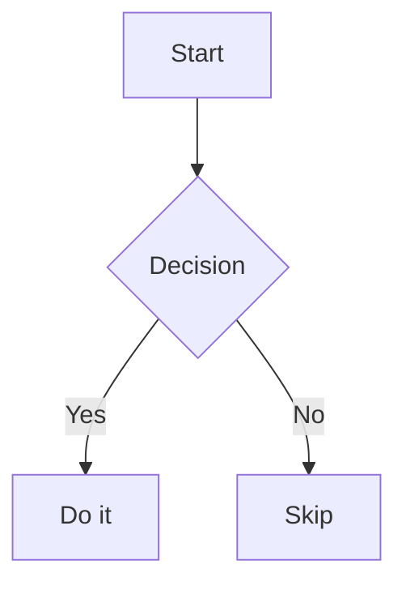

# User Guide

## First launch

On first launch, NoteBuddy will show the **onboarding wizard**:

1. **Welcome** — overview of features
2. **Choose folder** — pick a folder where your notes will live. A `WELCOME.md` guide is created here automatically.
3. **Tour** — an interactive walkthrough highlights each part of the UI

Your folder is remembered and reopened on every launch.

---

## The interface

```
┌─────────────────────────────────────────────────────┐
│  Toolbar  (traffic lights · actions · ⌘K · panels · ⚙) │
├─────────────────────────────────────────────────────┤
│  Tab bar  (open files · + new tab)                   │
├──────────┬──────────────────────────────────────────┤
│          │         Editor          │    Preview      │
│ Sidebar  │  ─────────────────────  │  ─────────────  │
│          │  CodeMirror editor      │  Rendered HTML  │
│ Filter   │                         │  + diagrams     │
│ Bookmarks│                         │  + math         │
│ Tags     │                         │                 │
│ Files    │                         │                 │
├──────────┴──────────────────────────────────────────┤
│  Status bar  (path · words · chars · reading time)  │
└─────────────────────────────────────────────────────┘
```

---

## Working with files

### Opening files
- Click any `.md` file in the sidebar
- `⌘K` → type a filename to search and open
- Toolbar → folder icon to open a file directly

### Multiple files (tabs)
- Each file opens in its own tab
- Click **+** or press the New File button to open a blank tab
- **Middle-click** a tab to close it
- Unsaved tabs show a blue dot; closing prompts for confirmation

### Saving
- `⌘S` — save current file
- `⌘K` → `> save as` — save with a new name

### File management (sidebar)
- **Hover** any file or folder to reveal rename (✎) and delete (🗑) buttons
- **Right-click** for a context menu with more options
- **+ button** on the sidebar header creates a new file in the root folder
- The **folder icon** opens a different folder

---

## Writing markdown

NoteBuddy supports full GitHub Flavoured Markdown:

```markdown
# Heading 1 — ## H2 — ### H3

**bold**  *italic*  ~~strikethrough~~

- Bullet list
1. Numbered list
- [ ] Task item (checkbox)

> Blockquote

[Link text](https://example.com)


| Column 1 | Column 2 |
| --- | --- |
| Cell | Cell |
```

---

## Wikilinks

Link between notes using double brackets:

```markdown
See also [[My Other Note]] for more details.
```

Clicking the link in the preview opens that note (looks for `My Other Note.md` in your folder).

---

## Code blocks

Fenced code blocks are syntax-highlighted in the preview and get **language-aware autocomplete** in the editor:

````markdown
```typescript
function greet(name: string) {
  return `Hello, ${name}!`;
}
```
````

Supported languages: TypeScript, JavaScript, Python, Rust, Go, Java, C++, SQL, Bash, CSS, HTML, YAML, and more.

Each code block has a **copy button** in the top-right corner of the preview.

---

## Mermaid diagrams

````markdown

````

---

## Math (KaTeX)

Inline math: `$E = mc^2$`

Display math:
```
$$
\int_0^\infty e^{-x^2} dx = \frac{\sqrt{\pi}}{2}
$$
```

---

## Frontmatter

Add YAML at the top of any note to get a metadata bar in the preview:

```yaml
---
title: My Note Title
type: concept
tags: [rust, programming, tutorial]
created: 2026-01-01
updated: 2026-04-11
---
```

**Types** get color-coded badges: `source` (blue), `concept` (purple), `entity` (green), `topic` (amber).

**Tags** are clickable — clicking one filters the file tree to show only notes with that tag.

---

## Emoji

Type `:` anywhere in the editor to trigger emoji autocomplete:

- `:smile` → 😄
- `:rocket` → 🚀
- `:check` → ✅

---

## Filtering notes

The **Filter** bar at the top of the sidebar lets you narrow the file tree:

- **Tags** — check one tag to show only files that have it
- **Date range** — filter by the `created` frontmatter date (From/To)
- Active filters are shown inline in the filter button
- Click **×** to clear all filters

---

## Bookmarks

- **Hover** any file in the sidebar → click the bookmark icon to pin it
- **Right-click** → Add/Remove bookmark
- Bookmarks appear at the top of the sidebar above the file tree

---

## Templates

Templates live in a `_templates/` folder inside your notes folder. NoteBuddy creates two starter templates on first launch:

- `Meeting Notes.md`
- `Daily Note.md`

To create a note from a template:
1. Right-click any folder in the sidebar
2. Choose **From template** → select a template
3. A new file is created with `{{date}}` replaced by today's date

To add your own templates, just create `.md` files in `_templates/`.

---

## Command palette (`⌘K`)

The fastest way to navigate and act:

| Type | Action |
|---|---|
| Any text | Full-text search across all notes |
| `> new` | New file |
| `> save` | Save current file |
| `> editor` / `> split` / `> preview` | Switch view |
| `> zen` | Toggle zen mode |
| `> export html` | Export as HTML |
| `> export pdf` | Open print preview |
| `> settings` | Open settings |

---

## Find & replace (`⌘F`)

Opens inside the editor. Features:
- Case sensitive toggle (`Aa`)
- Regex toggle (`.*`)
- Whole word toggle (`W`)
- Match counter
- Replace one / Replace all
- `↓ ↑` or Enter / Shift+Enter to navigate matches

---

## Zen mode (`⌘⇧Z`)

Hides the sidebar for distraction-free writing. The toolbar and tabs stay visible. Press `⌘⇧Z` or `Esc` to exit.

---

## Export

### Print / Save as PDF (`⌘P`)
Opens a print preview modal with clean typography. Click **Print / Save as PDF** and choose **Save as PDF** in the destination dropdown.

### Export as HTML
`⌘K` → `> export html` → choose a save location. Generates a self-contained HTML file with embedded CSS.

---

## Settings (`⚙`)

### Appearance
- **Color mode** — Dark / Light
- **Editor theme** — VS Code Dark, One Dark, GitHub Light
- **Code block theme** — GitHub Dark, GitHub Light, Atom One Dark, Monokai, Tokyo Night
- **Custom themes** — add your own highlight.js CSS (see below)
- **Font size** — 11–20px
- **Window opacity** — 30–100%
- **Vibrancy / blur** — macOS background blur

### Adding a custom code block theme

1. Open **Settings → Appearance**
2. Scroll to **Custom themes** under the Code block theme selector
3. Click **+ Add theme**
4. Enter a name (e.g. "Dracula")
5. Paste any [highlight.js-compatible theme CSS](https://highlightjs.org/examples) into the textarea
6. Click **Add theme** — it immediately appears in the dropdown and is applied

Themes are persisted across sessions. Remove a custom theme by clicking **Remove** in the custom themes list.

**Where to find themes:**
- https://highlightjs.org/examples — official themes browser
- https://github.com/highlightjs/highlight.js/tree/main/src/styles — raw CSS files
- https://github.com/highlightjs/highlight.js/wiki/Theme-Gallery — community themes

Any valid CSS that targets `.hljs` and its token classes works.

### Editor
- **Line numbers** — show/hide gutter
- **Line wrapping** — soft-wrap long lines
- **Auto-save** — save automatically after a delay (0.5s–5s)

### Tags
- Browse all tags found across your folder (with file counts)
- Click a tag to filter the file tree

### About
- App info + keyboard shortcuts reference
- **Take the tour** — restart the guided tour anytime

---

## Keyboard shortcuts reference

| Shortcut | Action |
|---|---|
| `⌘S` | Save |
| `⌘K` | Command palette |
| `⌘F` | Find & replace |
| `⌘P` | Print / Export PDF |
| `⌘⇧Z` | Toggle zen mode |
| `Ctrl+Space` | Trigger autocomplete |
| `Tab` | Accept autocomplete suggestion |
| `Esc` | Dismiss autocomplete / exit zen mode |
